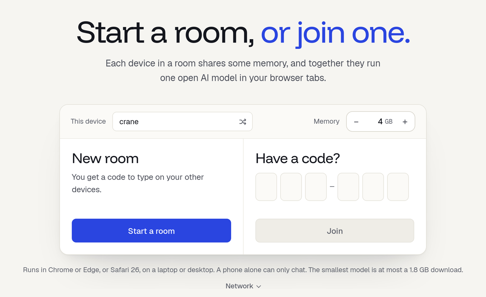
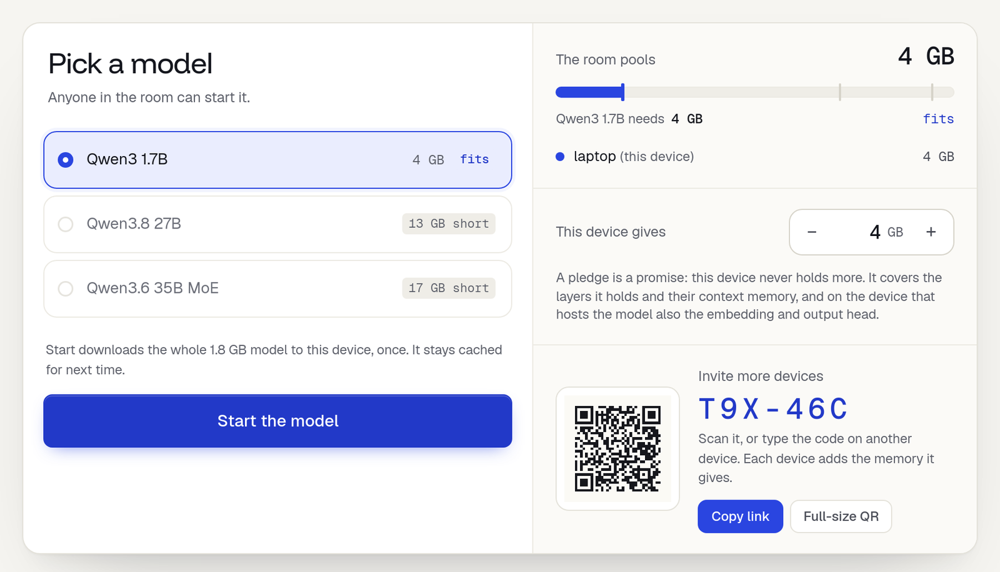

import { Steps } from '@astrojs/starlight/components';

{/*
Sources (for the fact-checker):
- p2p.html: join screen ("Start a room, or join one.", This device, Memory, Start a room, Have a code?), #ai-panel ("Pick a model", "Start the model", "The room pools", "This device gives"), #ai-prompt "Message the room", #ai-send
- room.js updateNeed(): "Needs N GB. The room has N GB." / "…, N GB short."; the picker preselects the biggest model that fits
- room/models.js: NEED_GB 4.0, FILE_GB 1.83 (Qwen3 1.7B)
- room/preflight.js, room/errors.js, troubleshooting.mdx (the three problems below)
- Verified 2026-09-30 on the Spark (GB10), pooled.run/room in headless Chromium (1280x800): default Memory 4 GB, picker rows ("fits", "13 GB short"),
  "Start downloads the whole 1.8 GB model to this device", online 43 s after Start (1.7 GB from Hugging Face), "Model ready on 1 device",
  answer line "14 tok · 24.4 tok/s · 1 device" (GPU shared with other jobs). Screenshots start.png, picker.png from that run.
*/}

**Goal:** ask an AI model a question, running on your own laptop, in a browser tab.

## You need

- **One laptop or desktop** with Chrome or Edge (113 or newer), or Safari 26. See [Browsers and requirements](/docs/browsers) for Linux and Firefox.
- **About 4 GB of free memory** for the model.
- **5 minutes**, and a **1.8 GB download** the first time. Later starts use the copy the browser keeps.

No account and nothing to install.

## Steps

<Steps>

1. **Open [pooled.run/room](https://pooled.run/room).**

   The page checks that the browser can use the GPU. If it can't, it says so and how to fix it.

   

2. **Check the two fields at the top.**

   **This device** is the name others will see. **Memory** is how many GB this laptop gives the room. Leave the default for now.

3. **Press Start a room.**

   You are in a room of one. The room code, like `4TK-G9P`, shows in the header. You only need it when you add devices.

4. **Pick Qwen3 1.7B.**

   **Pick a model** lists the three models. Each one says **fits**, or how many GB the room is short, like `13 GB short`. On one laptop, pick **Qwen3 1.7B**: it needs 4 GB. On the right, **The room pools** shows what this laptop gives.

   

5. **Press Start the model.**

   A card shows the download and then the load. On a fast connection this takes under a minute (43 seconds in our test). When it's done, the room says **Model ready on 1 device** and the message box at the bottom turns on.

6. **Ask something.**

   Type in **Message the room**, for example `Explain what a GPU is in two sentences.`, and press **Send**. The answer streams in word by word.

</Steps>

## What you should see

- After step 3: the room screen. The header shows the room code, **Invite** and how many GB the room pools.
- After step 5: **Qwen3 1.7B** and **Ready** at the top, with a bar of the layers this laptop holds.
- After step 6: an answer within a second or two, and under it a line like `14 tok · 24.4 tok/s · 1 device`. On a recent laptop the 1.7B writes about 20 to 50 tokens a second.

Keep the tab in front and the laptop plugged in while you use it. A background tab or a sleeping screen can stall the model.

## If something goes wrong

### "This device can chat but not help run the model"
The browser has no usable WebGPU. On Linux, Chrome needs `chrome://flags/#enable-unsafe-webgpu` and `chrome://flags/#enable-vulkan` turned on. On a Mac, update to Safari 26 or use Chrome. The join screen shows the fix for your browser under **Details**.

### Start the model stays grey
The model says the room is short, for example `2 GB short`. Raise **This device gives**, or press **Give N GB from this device**. If the laptop has less than 4 GB to spare, add a second device: see [Pool two devices](/docs/kits/two-devices).

### "Can't reach Hugging Face" while it downloads
The model comes from Hugging Face. A VPN, an ad blocker or a firewall can block it. Fix that and press **Start the model** again: the parts that already downloaded are kept.

More messages and fixes: [Troubleshooting](/docs/troubleshooting).

## Next

- [Pool two devices](/docs/kits/two-devices) to run a bigger model.
- [Build an app in Code mode](/docs/kits/build-an-app) with the model you just started.
- [Chat](/docs/chat): the queue, Stop, Continue and who sees what.
