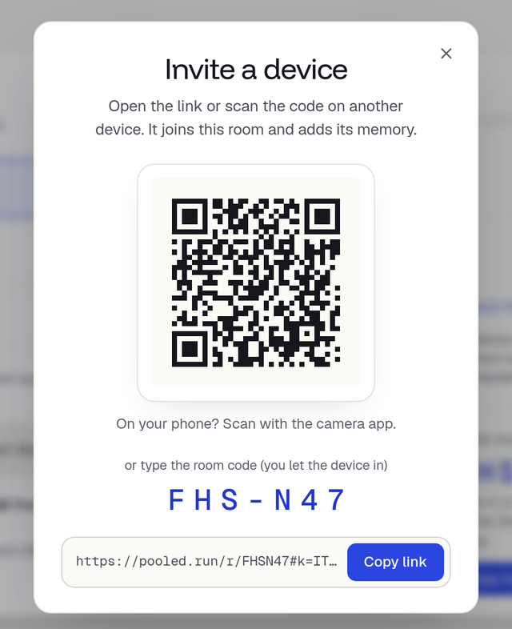
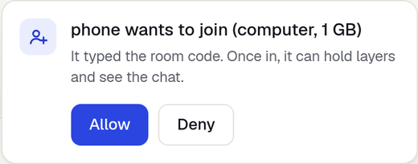

import { Steps, Tabs, TabItem } from '@astrojs/starlight/components';

{/*
Sources (for the fact-checker):
- p2p.html: #share-btn "Invite", #share sheet ("Invite a device", QR, "or type the room code", Copy link, Share…), #join-reqs ("A device wants to join", "It typed the room code. Once in, it can hold layers and see the chat.", Allow, Deny), #ap-gb "This device gives", "The room pools", ap-covers ("A pledge is a promise: this device never holds more…")
- room.js: roomLink() (/r/<code>#k=<key> on the host), inLobby() "Waiting for the host to let you in", requestLine(), metaPromise (default pledge: half of maxBufferSize, at least min(4 GB, budget) on a computer)
- room/joingate.js: CODE_LEN 6, invite key #k=, DENIED_TEXT "The host didn't let this device in."
- room/pledge.js: phone caps (iPhone 0.5 GB default, 1 GB max; Android 0.5-2 GB)
- room/plan.js: For speed split (fastest devices fill first, each up to its pledge; phones last, PHONE_COST 20)
- internals/benchmarks.mdx: GB10 + M5 Max over home Wi-Fi (MoE 35-37 alone, 29-35 split); GB10 + iPhone 1.7B 25.6-29.0 with a phone layer vs 47-51 asking only
- Verified 2026-09-30 on the Spark: three headless Chromium profiles on pooled.run/room (laptop 2 GB, desktop by invite link with 2 GB,
  a phone-size window by code + Allow with 1 GB); all on one GB10 over loopback, so no Wi-Fi in the numbers. Invite sheet, lobby card
  "phone wants to join (computer, 1 GB)" (the window had a desktop user agent), split desktop L0-11 (host) + laptop L12-27, answer
  "14 tok · 13.8 tok/s · 2 devices". Bug seen three times: a device the split leaves out stays on the Loading card; after a reload it shows the model picker (see the PR).
*/}

**Goal:** run one model across two devices, so together they hold more than either could alone.

## You need

- **A laptop** that opens the room, as in [Chat on one laptop](/docs/kits/first-chat).
- **A second device:** a desktop or another laptop with Chrome, Edge or Safari 26, or a phone (iPhone with iOS 26, or Android with Chrome 121+).
- **Both on the same Wi-Fi**, ideally. Other networks work too, but some block the direct link.
- **10 minutes.** Each device downloads only its own part of the model.

## Decide what each device gives

Each device gives the room some of its memory. This is its **pledge**: the device never holds more than that. The room adds the pledges up and runs any model that fits in the total.

- **Give what is really free.** On a Mac or a laptop without its own graphics card, the GPU shares memory with every open app.
- **A desktop with a graphics card** can give most of the card's memory.
- **A phone** can give only a little, 0.5 to 2 GB. It mostly joins to ask questions. See [Phones and tablets](/docs/phones).

| To run | The room needs |
|---|---|
| Qwen3 1.7B | 4 GB |
| Qwen3.8 27B | 17 GB |
| Qwen3.6 35B MoE | 22.5 GB |

So a 16 GB laptop giving 8 GB and a desktop giving 16 GB can run the 27B or the MoE, which neither could run alone.

## Steps

<Steps>

1. **Open the room on the laptop.** Go to [pooled.run/room](https://pooled.run/room), set **Memory**, and press **Start a room**. Don't start a model yet.

2. **Press Invite** in the header.

   The **Invite a device** sheet shows a QR code, the room code and a **Copy link** button.

   

3. **Bring in the second device.**

   <Tabs>
     <TabItem label="Desktop or laptop">
       Send yourself the link (**Copy link**, then paste it in a chat or a note) and open it on the desktop. It joins at once. Check **Memory** on its join screen, or **This device gives** once it's in.
     </TabItem>
     <TabItem label="Phone">
       Point the phone's camera at the QR code and open the link. It joins at once, with a small pledge set for you.
     </TabItem>
   </Tabs>

   The invite link and the QR code carry a key, so the device gets in without asking.

4. **If a device typed the code instead, let it in.**

   A device that typed the code on [pooled.run/room](https://pooled.run/room) waits with `Waiting for the host to let you in`. On the laptop, a card names it, its kind and what it gives, like `phone wants to join (computer, 1 GB)`. Press **Allow**, or **Deny** if you don't know it.

   

5. **Check the room's total.**

   The header now lists both devices, and **The room pools** shows their pledges added up. The picker preselects the biggest model that fits, and the line above **Start the model** says how much this device will download, like `Start downloads about 620 MB to this device (its share of 1.8 GB)`.

6. **Press Start the model.**

   Each device downloads and loads only its layers. The load card shows a row per device.

7. **Ask something**, from either device.

</Steps>

## What you should see

- After step 3 or 4: the second device in the room's device list, and its memory added to **The room pools**.
- After step 6: **Ready**, and a bar per device with the layers it holds, like `desktop layers 1–12` and `laptop layers 13–28`. The room picks which device hosts the model: not always the one that pressed Start. By default it gives layers to the fastest devices first, each up to its pledge. A device that isn't needed to hold the model joins to ask, and a phone usually does.
- After step 7: the answer on the screens that see the chat, with a line like `14 tok · 13.8 tok/s · 2 devices`.

### How fast to expect

Every word the model writes passes through each device that holds layers, so every device adds a network hop.

- **One device, when the model fits:** fastest. Don't split a model that fits on one device.
- **Two computers on good Wi-Fi:** a bit slower than one. On our test pair (a GB10 and a Mac, over home Wi-Fi, the 35B MoE) the split ran at about 29 to 35 words a second against 35 to 37 on one machine.
- **A phone holding layers:** much slower. A 1.7B room ran at 26 to 29 tok/s with a phone holding one layer, against 47 to 51 once the phone only asked.

So pool devices to run a model that doesn't fit on one, not to make a small model faster. Numbers for more setups: [Benchmarks](/docs/internals/benchmarks).

## If something goes wrong

### The device waits at "Still connecting…", then "these two devices can't reach each other"
The network blocks a direct link between them. Put both on the same Wi-Fi, turn off any VPN, or try a phone hotspot. Work and school Wi-Fi often block it: see [Networks and work Wi-Fi](/docs/rooms/networks).

### "No room with that code."
Check the code with the laptop's header. The room lives in the laptop's tab: if that tab closed, the room is gone. Codes never use I, L, O, U, 0 or 1.

### The second device joined but holds no layers
That is normal when the laptop alone can hold the model: the room keeps the fastest devices and the rest ask. To run the model across both, pick a bigger model, or lower the laptop's **This device gives** before you press **Start the model**. A device that joins after the start waits until the laptop presses **Re-deal the layers**.

Right now a device that holds no layers can stay on the **Loading** card after the model is ready, even after a reload, and can't ask from there. Until that is fixed, ask from a device that holds layers.

More: [Troubleshooting](/docs/troubleshooting#joining-a-room).

## Next

- [Pick a model](/docs/models) for the memory you pooled.
- [Build an app in Code mode](/docs/kits/build-an-app).
- [Invite devices](/docs/invite): who gets in and how the lobby works.
- [How layers are split](/docs/rooms/split).
